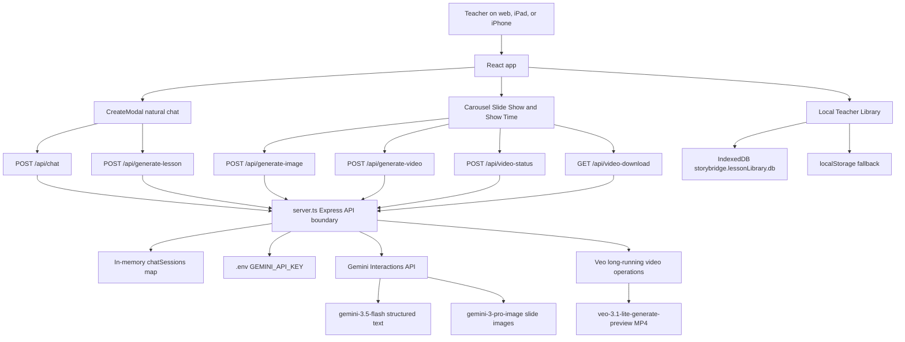
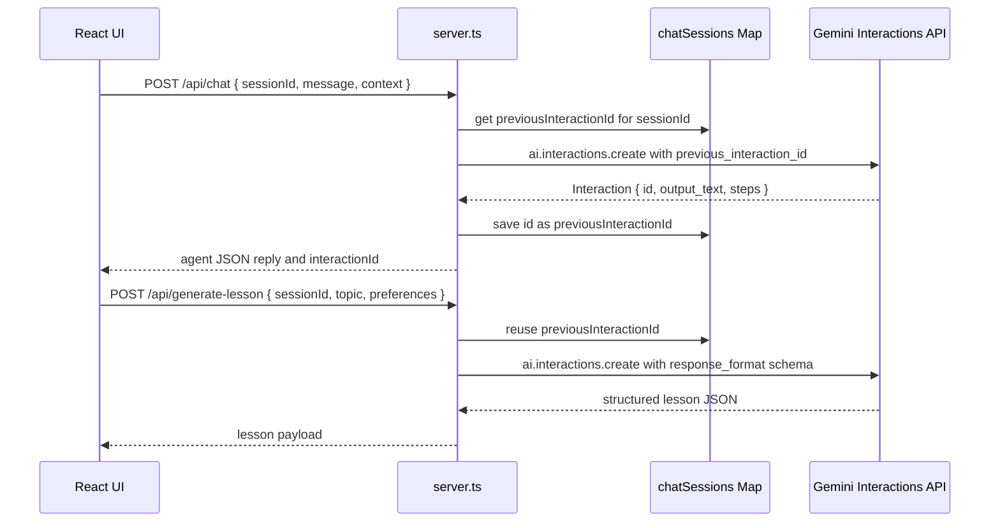

# StoryBridge

StoryBridge is a web app for K-12 teachers who support autistic learners. It helps teachers describe a classroom need in plain language, then turns that conversation into calm, visual-first lessons that can be used as a slide show or as short Show Time video moments.

The product goal is simple: a teacher should be able to say something like "make a lesson about washing hands for first grade" or "create a teen-friendly lesson about asking for a break during group work" and receive an age-appropriate, sensory-friendly visual lesson without becoming a prompt engineer.

## What It Does Today

- Natural lesson creation chat with a StoryBridge agent.
- Structured lesson planning for titles, objectives, slides, narration, teacher notes, interaction cues, and sensory goals.
- AI image generation for full-slide images where the slide text is generated inside the artwork.
- AI video generation for Show Time clips using Veo long-running operations.
- Swipe-friendly slide viewing on desktop, iPad, and iPhone-sized screens.
- Saved Teacher Library with search and filters for slide lessons and Show Time lessons.
- Teacher profile/library entry from the top-right avatar.
- Native browser text-to-speech through "Listen again".
- Comfort controls for captions, larger text, calmer motion, autoplay, and TTS speed.
- Local persistence through IndexedDB with localStorage fallback.

## Product Principles

StoryBridge is built for teachers working with autistic children, so the design and AI outputs need to be calm, concrete, and respectful.

- Use neurodiversity-affirming language.
- Support choice, autonomy, sensory awareness, and communication.
- Avoid shame, punishment, forced eye contact, compliance framing, and medical claims.
- Keep slide language short, literal, and age-appropriate.
- Keep visuals uncluttered, predictable, and low-arousal.
- Do not overlay app text on top of generated slide images. The model should render the learner-facing text as part of the generated image or video whenever supported.

## Tech Stack

- React 19
- Vite 6
- TypeScript
- Express
- Tailwind CSS v4
- `motion/react`
- `lucide-react`
- `@google/genai`
- Gemini Interactions API for chat, structured lesson planning, and image generation
- Veo video generation through Gemini long-running video operations

## Repository Map

```text
.
|-- server.ts                         # Express server, Gemini API boundary, Vite middleware
|-- src/
|   |-- App.tsx                       # Main app shell, library state, media orchestration
|   |-- main.tsx                      # React entrypoint
|   |-- types.ts                      # Lesson, slide, media, and comfort setting types
|   |-- index.css                     # Brand tokens, Tailwind, global sensory-friendly styling
|   `-- components/
|       |-- Carousel.tsx              # Slide Show and Show Time player
|       |-- CreateModal.tsx           # Agentic creation chat
|       |-- Icon.tsx                  # StoryBridge brand/icon helpers
|       `-- LoadingSpinner.tsx
|-- docs/
|   `-- product-gap-tracker.md        # Product gap tracker and implementation notes
|-- .env.example                      # Safe environment template
`-- package.json
```

## AI Architecture

All Gemini calls must stay server-side in `server.ts`. The client should never receive or reference `GEMINI_API_KEY`.

### System Diagram



### Request Flow

```text
Teacher prompt
  -> React CreateModal
  -> server.ts /api/chat
  -> ai.interactions.create
  -> server stores interaction.id as previousInteractionId
  -> React shows agent reply and inferred draft
  -> /api/generate-lesson creates structured lesson JSON
  -> /api/generate-image creates full-slide images through Interactions
  -> /api/generate-video starts Veo operation when Show Time video is needed
  -> /api/video-status polls until done
  -> /api/video-download streams the MP4
  -> Carousel plays Slide Show or Show Time
  -> App saves lesson locally
```

### Server Endpoints

| Endpoint | Purpose | Gemini path |
| --- | --- | --- |
| `GET /api/ai-status` | Reports whether Gemini features are configured and which models are selected. | No generation call |
| `POST /api/chat` | Agentic teacher conversation with session memory. | `ai.interactions.create` |
| `POST /api/generate-lesson` | Creates structured lesson JSON. | `ai.interactions.create` |
| `POST /api/generate-image` | Creates a complete slide image. | `ai.interactions.create` with `response_modalities: ["image"]` |
| `POST /api/generate-video` | Starts a Veo video job. | `ai.models.generateVideos` |
| `POST /api/video-status` | Polls a Veo operation. | `ai.operations.getVideosOperation` |
| `GET /api/video-download?op=...` | Streams the completed MP4 to the app. | Fetches the generated video URI with server API key |

### Interactions API Details

Google describes the Interactions API as the recommended Gemini interface for new projects. StoryBridge uses it for the parts of the product that benefit from a single turn resource, stateful conversation, structured output, and multimodal output.

In this app, every `ai.interactions.create` call is a complete task turn:

- `/api/chat` creates a teacher-agent conversation turn.
- `/api/generate-lesson` creates structured lesson JSON from the conversation and preferences.
- `/api/generate-image` creates a complete generated slide image using `response_modalities: ["image"]`.

The returned interaction `id` matters. `server.ts` saves it as `previousInteractionId` inside the `chatSessions` map, keyed by the client `sessionId`. The next chat or lesson call sends that value back as `previous_interaction_id`, which lets Gemini retrieve the prior conversation history without the browser resending the whole transcript.



Important implementation details:

- Re-send `system_instruction` on every Interactions call. Google treats it as interaction-scoped, not permanently attached to the conversation.
- Re-send `generation_config`, `response_format`, and any future tools on each call that needs them.
- Keep `response_format` schemas close to the server endpoint that owns them.
- Keep Interactions parsing defensive because model responses can appear as `output_text`, `outputs`, or `steps` depending on modality and SDK behavior.
- Use `store=true` default behavior when we need `previous_interaction_id`. If a future privacy mode sets `store=false`, that mode cannot rely on server-side conversation continuation.

### Why Video Uses A Different Path

Text, chat, structured lesson output, and images use the Gemini Interactions API.

Video generation currently uses Veo's long-running operation flow through `ai.models.generateVideos` and `GenerateVideosOperation`. Do not replace this with a synchronous Interactions call unless Google exposes the same Veo operation lifecycle through Interactions and the app is updated to poll that lifecycle.

### Stateful Chat

`/api/chat` stores `previousInteractionId` in an in-memory `Map` by `sessionId`. This lets the StoryBridge agent carry context through a creation conversation.

This is prototype-grade state. If we add accounts or cloud persistence, move session state to durable storage.

### Official References

- Gemini Interactions API overview: https://ai.google.dev/gemini-api/docs/interactions-overview
- Gemini API docs: https://ai.google.dev/gemini-api/docs

## Environment Setup

Create a local `.env` file from the template:

```bash
cp .env.example .env
```

Then set a Gemini API key:

```bash
GEMINI_API_KEY="YOUR_GEMINI_API_KEY"
```

Get a key from Google AI Studio or the Gemini API console. The key must support the selected Gemini and Veo models.

Optional model overrides:

```bash
GEMINI_TEXT_MODEL="gemini-3.5-flash"
GEMINI_IMAGE_MODEL="gemini-3-pro-image"
GEMINI_VIDEO_MODEL="veo-3.1-lite-generate-preview"
```

Important:

- Never commit `.env`.
- `.gitignore` ignores `.env*` and explicitly allows `.env.example`.
- Do not add `VITE_` prefixes to secrets. Anything prefixed with `VITE_` can be exposed to the browser.
- Restart the dev server after changing `.env`.

## Local Development

Install dependencies:

```bash
npm install
```

Start the app:

```bash
npm run dev
```

Open:

```text
http://localhost:3000
```

The Express server and Vite dev middleware run from `server.ts`, so API routes and the React app share the same origin.

## Build And Run Production Bundle

Build:

```bash
npm run build
```

Run:

```bash
npm run start
```

The build creates:

- Vite client output in `dist/`
- Bundled server at `dist/server.cjs`

## Validation Commands

Type-check the project:

```bash
npm run lint
```

Build the production bundle:

```bash
npm run build
```

Check AI configuration without triggering generation:

```bash
curl http://localhost:3000/api/ai-status
```

Expected shape:

```json
{
  "geminiConfigured": true,
  "textGenerationReady": true,
  "imageGenerationReady": true,
  "videoGenerationReady": true,
  "textModel": "gemini-3.5-flash",
  "imageModel": "gemini-3-pro-image",
  "videoModel": "veo-3.1-lite-generate-preview"
}
```

If `geminiConfigured` is false, check `.env`, confirm the variable is named `GEMINI_API_KEY`, and restart `npm run dev`.

## Testing Image Generation

Start the dev server, then run:

```bash
curl -X POST http://localhost:3000/api/generate-image \
  -H "Content-Type: application/json" \
  -d '{
    "slideText": "I wash my hands with soap.",
    "prompt": "A complete StoryBridge slide for young learners showing hands at a classroom sink with soap bubbles, warm watercolor storybook style, calm and uncluttered.",
    "aspectRatio": "16:9"
  }'
```

The response should include an `imageUrl`, usually as a data URL or Gemini-hosted URI depending on the model response.

## Testing Video Generation

Video generation can take a few minutes and may incur provider cost. Use short prompts and avoid repeatedly starting jobs while one is still polling.

Start a video operation:

```bash
curl -X POST http://localhost:3000/api/generate-video \
  -H "Content-Type: application/json" \
  -d '{
    "slideText": "I wash my hands with soap.",
    "prompt": "A complete StoryBridge animated slide showing hands washing with soap at a classroom sink. Gentle predictable motion, no fast cuts, calm watercolor storybook style.",
    "aspectRatio": "16:9"
  }'
```

Copy the returned `operationName`, then poll:

```bash
curl -X POST http://localhost:3000/api/video-status \
  -H "Content-Type: application/json" \
  -d '{"operationName":"PASTE_OPERATION_NAME_HERE"}'
```

When `done` and `hasVideo` are true, download or open:

```text
http://localhost:3000/api/video-download?op=PASTE_OPERATION_NAME_HERE
```

In the app, lessons with video media should play from the Show Time tab.

## Data Storage

StoryBridge currently stores teacher library data locally in the browser.

Primary storage:

- IndexedDB database: `storybridge.lessonLibrary.db`
- Object store: `lessons`

Fallback and metadata:

- `storybridge.lessonLibrary.v1`
- `storybridge.savedLesson.v1`

This means generated lessons are local to the current browser profile. Clearing browser storage can remove saved lessons. Cloud accounts and shared school libraries are future product work.

## Accessibility And Sensory-Friendly UX

Keep UI work aligned with the app's audience:

- Prefer one focused screen over complex navigation.
- Use calm spacing, clear hierarchy, and predictable controls.
- Keep animation purposeful and smooth.
- Preserve haptic feedback with `navigator.vibrate(50)` where supported.
- Keep touch targets large enough for iPhone SE and up.
- Preserve horizontal swipe behavior for slide browsing and saved lessons.
- Maintain readable text for browser TTS.

## AI Prompting Guidelines

Generation prompts should enforce:

- One learning idea per slide.
- Age-appropriate tone and visuals.
- Inclusive characters and school-safe settings.
- No clutter, fast cuts, flashing lights, or sudden camera moves.
- No shame, punishment, restraint, forced eye contact, or compliance framing.
- No stereotypes about autistic learners.
- Hygiene visuals limited to school-safe items like hands, sinks, soap, towels, and toothbrushes.
- Sensitive topics such as body safety, bullying, self-injury, medical issues, aggression, or elopement should stay calm, non-graphic, and trusted-adult oriented.

Age guidance:

- K-2: simple first-person or shared-language sentences, one concrete action per slide.
- Grades 3-5: concrete cause-and-effect, simple emotion naming, collaborative classroom examples.
- Grades 6-8: respectful preteen tone, autonomy, boundaries, transitions, and self-advocacy.
- Grades 9-12: dignified teen tone, independence, planning, school/community/work-readiness contexts.

## Development Guardrails

- Keep all Gemini API calls in `server.ts`.
- Do not expose `GEMINI_API_KEY` to React code.
- Do not use legacy `generateContent` for chat, lesson JSON, or images.
- Use Interactions API for text, structured output, stateful chat, and images.
- Keep Veo video generation on the long-running operation path until the provider supports equivalent Interactions behavior.
- Do not overlay slide text in the app over AI images. The generated media should contain the text.
- Use the CSS variables in `src/index.css` instead of adding unrelated color systems.
- Keep generated media, secrets, and local test artifacts out of git.

## Next Tasks And Product Roadmap

StoryBridge currently works as a local-first prototype with real Gemini image and video generation. The next phase should move it toward a durable multi-user product for teachers and schools.

### P0: Auth, Accounts, And Ownership

- Add proper authentication for teachers.
- Create user-owned workspaces so generated lessons belong to a teacher account instead of a browser profile.
- Add basic profile fields: name, role, school or organization, grade bands served, preferred lesson tone, and default accessibility settings.
- Protect all lesson and media routes by user session once auth exists.
- Add server-side authorization checks so a teacher can only read, update, or delete their own lessons unless sharing is explicitly enabled.

Suggested first implementation:

```text
Auth provider
  -> user table
  -> teacher profile table
  -> session middleware in server.ts
  -> user_id on every lesson and media record
```

### P0: Durable Database And Media Storage

The current browser storage is useful for prototyping, but it is not enough for generated images and videos.

- Add a real database for lessons, slides, prompts, generation jobs, teacher profiles, and sharing metadata.
- Add object storage for generated images and MP4 files.
- Store media URLs or object keys in the database instead of storing large base64 blobs in localStorage.
- Persist generation job state so long video jobs survive refreshes, browser crashes, and device switches.
- Track media status per slide: `queued`, `generating`, `ready`, `failed`, and `retrying`.
- Add cleanup policies for failed or abandoned media operations.
- Add migration scripts and seed data for local development.

Recommended schema direction:

```text
users
teacher_profiles
lessons
slides
media_assets
generation_jobs
lesson_shares
```

Media storage needs:

- Images: original generated image, optimized web image, thumbnail.
- Videos: original MP4, poster thumbnail, duration, aspect ratio, playback URL.
- Prompts: final prompt, slide text, model name, provider operation ID, safety notes.

### P0: Production AI Job Pipeline

Generation is currently request-driven from the app. A production version should make media generation more resilient.

- Move long-running media work into a job queue.
- Let the UI subscribe to generation updates instead of polling only from the open page.
- Add retry behavior for recoverable Gemini or network failures.
- Store provider operation IDs for Veo jobs.
- Add rate limits per user and per school workspace.
- Add cost tracking by model, media type, slide count, and user.
- Add clear failure messages that help teachers recover without exposing provider internals.

### P1: Profile And Library System

The Teacher Library exists, but the profile system should become a real product surface.

- Make the top-right profile entry the home for saved lessons, defaults, account settings, and generation history.
- Add teacher defaults for grade band, classroom context, sensory preferences, language level, and preferred visual style.
- Add folders, tags, favorites, and recently used lessons.
- Add "duplicate and remix" for previous lessons.
- Add lesson export options: JSON, printable PDF, image pack, and eventually share link.
- Add shared school libraries so teams can reuse approved lessons.

### P1: Better Slideshow And Show Time Authoring

- Add a lightweight editor for slide text, narration, teacher notes, and prompts before generation.
- Let teachers regenerate a single slide image or video without rebuilding the whole lesson.
- Add reorder, duplicate, delete, and insert slide controls.
- Add per-slide format choice: still image, gentle animated clip, or no media yet.
- Add preview thumbnails for generated media.
- Add teacher-facing notes that never appear in the learner slideshow.
- Add more robust text-to-speech controls and browser support checks.

### P1: Illustrative Design System

The current design direction is calm, soft, and storybook-like. The next design pass should make that feel more custom and less generic.

- Build a small custom illustration kit for StoryBridge icons, empty states, cards, and profile surfaces.
- Add custom generated or hand-authored backgrounds that stay low-contrast and do not compete with lesson media.
- Improve card composition for saved lessons, generation jobs, and profile panels.
- Keep one-screen mobile ergonomics as a hard requirement, especially on iPhone SE and small Safari viewports.
- Keep horizontal swipe patterns for lesson browsing where they reduce vertical scrolling.
- Add motion polish that feels responsive without becoming overstimulating.
- Keep color usage tied to `src/index.css` design tokens.

### P1: Safety, Review, And Classroom Trust

- Add a teacher review step before generated lessons are marked classroom-ready.
- Add content warnings or extra review gates for sensitive topics.
- Store safety notes returned by the agent and expose them in the teacher guide.
- Add a reporting path for generated media issues, including bad text rendering or inappropriate imagery.
- Add age-band checks before generation and before saving to shared libraries.
- Add a school-safe prompt library for common topics like hygiene, transitions, self-advocacy, emotion naming, and classroom routines.

### P2: Collaboration, Sharing, And Deployment

- Add share links with permission controls.
- Add school or district workspaces.
- Add admin review for shared lesson templates.
- Add usage analytics that respect privacy and avoid collecting student data.
- Add deployment docs for the chosen hosting target.
- Add environment-specific config for development, staging, and production.
- Add monitoring for API failures, video job duration, and storage errors.

### Suggested Implementation Order

```text
1. Choose auth and database stack.
2. Add users, teacher_profiles, lessons, slides, media_assets, and generation_jobs.
3. Move saved lessons from local browser storage to server-backed storage.
4. Move generated images and videos to object storage.
5. Make video jobs durable and resumable.
6. Upgrade the profile/library page around real account data.
7. Add single-slide editing and regeneration.
8. Deepen the custom illustrative design system.
9. Add classroom review, sharing, and school library workflows.
10. Add production monitoring, cost controls, and deployment docs.
```

## Troubleshooting

### `GEMINI_API_KEY is not configured`

Create `.env`, set `GEMINI_API_KEY`, and restart the dev server.

### `/api/ai-status` says video is not ready

Confirm `GEMINI_API_KEY` is present and `GEMINI_VIDEO_MODEL` is not empty. The default model is `veo-3.1-lite-generate-preview`.

### Video generation starts but does not play

Poll `/api/video-status` until `done` and `hasVideo` are true. If the operation is done without a video, inspect the server log for provider errors. If the MP4 exists but the browser does not autoplay, open Show Time and start playback manually.

### Images or videos have bad text

Model-rendered text can be imperfect. Keep slide text short, literal, and high contrast. The prompt should say the exact text must be rendered inside the generated media and that no other readable text should appear.

### Saved lessons disappear

The current library is local-browser storage. Check whether the browser profile, storage, or site data was cleared.

### Port 3000 is already in use

Stop the other process or update `PORT` in `server.ts` before running the dev server.

## Current Verification Snapshot

As of June 28, 2026:

- `npm run lint` passes.
- `npm run build` passes.
- Real Gemini image generation has been exercised through `/api/generate-image`.
- Real Veo generation has produced a playable MP4 through `/api/generate-video`, `/api/video-status`, and `/api/video-download`.
- The generated video plays in the Show Time tab.

Re-run the validation commands after changes that touch `server.ts`, `src/App.tsx`, `src/components/Carousel.tsx`, or `src/components/CreateModal.tsx`.
